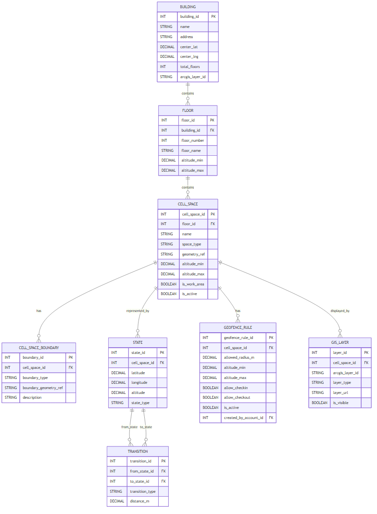
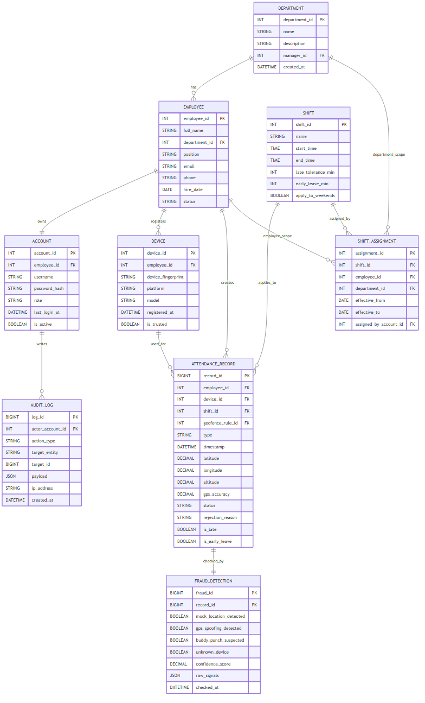
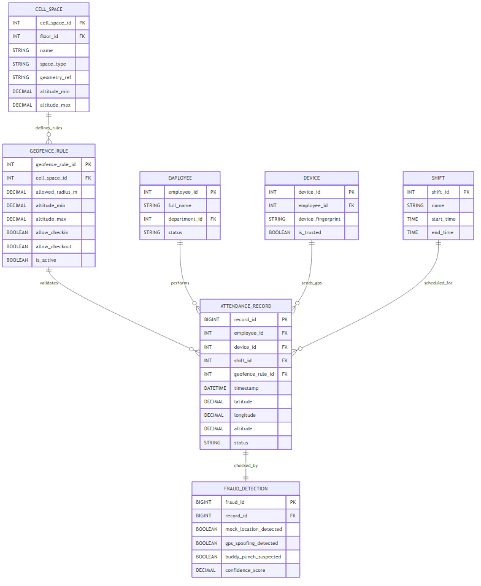

# ĐỒ ÁN MÔN HỌC

## HỆ THỐNG CHẤM CÔNG TỰ ĐỘNG SỬ DỤNG GIS 3D VÀ GPS

**Môn học:** Hệ thống thông tin địa lý 3 chiều  
**Lớp:** IE402.Q21  
**Tên nhóm:** Nhóm 9

| STT | MSSV | Họ và tên |
| --- | --- | --- |
| 1 | 23521718 | Nguyễn Hà Minh Tuấn |
| 2 | 23521687 | Trần Nguyễn Đức Trung |
| 3 | 23521741 | Mô Văn Tùng |
| 4 | 23521747 | Trần Phan Thanh Tùng |
| 5 | 23520870 | Huỳnh Tiến Lợi |

## Ghi Chú Về Bản Revised

Bản báo cáo này được tạo mới, không ghi đè lên file gốc `Nhom_9-Checkpoint3.pdf` hoặc `Nhom_9-Checkpoint3.docx`. Nội dung tập trung chỉnh sửa Chương 2 theo hướng tách mô hình dữ liệu thành hai schema: schema GIS 3D và schema dịch vụ ứng dụng. Các sơ đồ ERD được sinh thành file riêng ở định dạng Mermaid, SVG và PNG.

# Mục Lục

1. [Chương 1: Giới thiệu đề tài](#chương-1-giới-thiệu-đề-tài)
2. [Chương 2: Xác định thực thể, quan hệ và mô hình dữ liệu bài toán](#chương-2-xác-định-thực-thể-quan-hệ-và-mô-hình-dữ-liệu-bài-toán)
3. [Tài liệu tham khảo](#tài-liệu-tham-khảo)
4. [TODO và ghi chú nộp bài](#todo-và-ghi-chú-nộp-bài)

# Danh Mục Hình

| Mã hình | Tên hình | File |
| --- | --- | --- |
| Hình 2.1 | ERD Schema GIS 3D tham chiếu IndoorGML | `erd_gis_3d_indoor_gml.mmd`, `erd_gis_3d_indoor_gml.svg`, `erd_gis_3d_indoor_gml.png` |
| Hình 2.2 | ERD Schema dịch vụ ứng dụng | `erd_app_service_schema.mmd`, `erd_app_service_schema.svg`, `erd_app_service_schema.png` |
| Hình 2.3 | ERD liên kết giữa hai schema | `erd_schema_integration.mmd`, `erd_schema_integration.svg`, `erd_schema_integration.png` |

# Danh Mục Bảng

| Mã bảng | Tên bảng |
| --- | --- |
| Bảng 2.1 | Nhóm thực thể schema GIS 3D |
| Bảng 2.2 | Nhóm thực thể schema dịch vụ ứng dụng |
| Bảng 2.3 | Thuộc tính BUILDING |
| Bảng 2.4 | Thuộc tính FLOOR |
| Bảng 2.5 | Thuộc tính CELL_SPACE |
| Bảng 2.6 | Thuộc tính CELL_SPACE_BOUNDARY |
| Bảng 2.7 | Thuộc tính STATE |
| Bảng 2.8 | Thuộc tính TRANSITION |
| Bảng 2.9 | Thuộc tính GEOFENCE_RULE |
| Bảng 2.10 | Thuộc tính GIS_LAYER |
| Bảng 2.11 | Thuộc tính DEPARTMENT |
| Bảng 2.12 | Thuộc tính EMPLOYEE |
| Bảng 2.13 | Thuộc tính ACCOUNT |
| Bảng 2.14 | Thuộc tính DEVICE |
| Bảng 2.15 | Thuộc tính SHIFT |
| Bảng 2.16 | Thuộc tính SHIFT_ASSIGNMENT |
| Bảng 2.17 | Thuộc tính ATTENDANCE_RECORD |
| Bảng 2.18 | Thuộc tính FRAUD_DETECTION |
| Bảng 2.19 | Thuộc tính AUDIT_LOG |
| Bảng 2.20 | Ánh xạ khái niệm IndoorGML sang schema GIS 3D |

# Chương 1: Giới Thiệu Đề Tài

## 1.1 Đặt Vấn Đề

Trong bối cảnh chuyển đổi số, doanh nghiệp cần quản lý nhân sự và chấm công một cách linh hoạt hơn so với các phương pháp truyền thống như thẻ từ hoặc máy chấm công vân tay. Các phương pháp cũ thường khó hỗ trợ nhiều địa điểm làm việc, khó kiểm tra vị trí thực tế và dễ phát sinh gian lận như chấm công hộ.

Đề tài xây dựng hệ thống chấm công tự động sử dụng GPS 3 chiều gồm latitude, longitude và altitude để ghi nhận vị trí thực tế tại thời điểm chấm công. Hệ thống kết hợp dữ liệu GIS 3D để quản lý tòa nhà, tầng và khu vực làm việc, đồng thời hỗ trợ dashboard cho HR/Admin theo dõi vị trí chấm công trong không gian 3D.

## 1.2 Mục Tiêu

Hệ thống hướng đến các mục tiêu chính sau:

- Nhân viên có thể check-in/check-out bằng ứng dụng di động.
- Hệ thống ghi nhận tọa độ GPS 3D tại thời điểm chấm công.
- HR/Admin có thể cấu hình khu vực chấm công theo tòa nhà, tầng và khu vực làm việc.
- Hệ thống kiểm tra vị trí chấm công dựa trên tọa độ, độ cao và quy tắc geofence.
- Hệ thống lưu kết quả kiểm tra gian lận và nhật ký thao tác để phục vụ truy vết.

## 1.3 Phạm Vi Đề Tài

Đề tài tập trung vào mô hình dữ liệu và quy trình chấm công cho doanh nghiệp có nhân viên làm việc tại văn phòng hoặc địa điểm cố định. Phạm vi dữ liệu gồm thông tin nhân viên, tài khoản, thiết bị, ca làm việc, dữ liệu không gian trong nhà, bản ghi chấm công, kết quả phát hiện gian lận và audit log.

Ngoài phạm vi của bản thiết kế này là tính lương tự động, quản lý hợp đồng lao động, tích hợp kế toán và mô hình làm việc từ xa ngoài vùng chấm công đã cấu hình.

# Chương 2: Xác Định Thực Thể, Quan Hệ Và Mô Hình Dữ Liệu Bài Toán

## 2.1 Xác Định Các Thực Thể Bài Toán

Dựa trên phạm vi dữ liệu, nhóm tách mô hình dữ liệu thành hai schema chính:

- **Schema GIS 3D:** quản lý tòa nhà, tầng, vùng không gian trong nhà, ranh giới, node đại diện không gian, kết nối giữa các node, quy tắc geofence và lớp hiển thị GIS 3D.
- **Schema dịch vụ ứng dụng:** quản lý nghiệp vụ chấm công gồm nhân viên, phòng ban, tài khoản, thiết bị, ca làm việc, bản ghi chấm công, phát hiện gian lận và audit log.

Cách tách này giúp phần GIS tập trung vào mô hình không gian, còn phần dịch vụ ứng dụng tập trung vào dữ liệu nghiệp vụ phát sinh trong quá trình vận hành hệ thống.

### 2.1.1 Schema GIS 3D

Schema GIS 3D tham chiếu các khái niệm lõi của OGC IndoorGML để thiết kế cấu trúc dữ liệu trong nhà. Hệ thống không triển khai đầy đủ chuẩn XML/GML của IndoorGML, mà chỉ dùng các khái niệm phù hợp để thiết kế ERD ở mức cơ sở dữ liệu quan hệ.

**Bảng 2.1. Nhóm thực thể schema GIS 3D**

| Thực thể | Mô tả |
| --- | --- |
| Building | Tòa nhà hoặc địa điểm làm việc. |
| Floor | Tầng trong tòa nhà, có khoảng độ cao `altitude_min` và `altitude_max`. |
| CellSpace | Vùng không gian trong nhà thuộc một tầng. |
| CellSpaceBoundary | Ranh giới hình học hoặc tham chiếu hình học của CellSpace. |
| State | Điểm đại diện cho CellSpace, phục vụ định vị hoặc điều hướng. |
| Transition | Kết nối giữa các State. |
| GeofenceRule | Quy tắc cho phép check-in/check-out trong một CellSpace. |
| GISLayer | Lớp hiển thị trên ArcGIS Scene View 3D. |

### 2.1.2 Schema Dịch Vụ Ứng Dụng

Schema dịch vụ ứng dụng giữ các thực thể nghiệp vụ chấm công đã có trong bản thiết kế ban đầu. `AttendanceRecord` được giữ trong schema dịch vụ vì đây là dữ liệu giao dịch phát sinh khi nhân viên check-in hoặc check-out, không phải dữ liệu mô tả không gian GIS.

**Bảng 2.2. Nhóm thực thể schema dịch vụ ứng dụng**

| Thực thể | Mô tả |
| --- | --- |
| Department | Phòng ban hoặc đơn vị trong doanh nghiệp. |
| Employee | Nhân viên thuộc doanh nghiệp. |
| Account | Tài khoản đăng nhập của người dùng hệ thống. |
| Device | Thiết bị di động đã được xác thực để chấm công. |
| Shift | Ca làm việc được cấu hình cho nhân viên hoặc phòng ban. |
| ShiftAssignment | Bảng gán ca làm việc cho nhân viên hoặc phòng ban. |
| AttendanceRecord | Bản ghi chấm công check-in/check-out của nhân viên. |
| FraudDetection | Kết quả kiểm tra gian lận của một lần chấm công. |
| AuditLog | Nhật ký ghi lại các thao tác quan trọng trong hệ thống. |

## 2.2 Xác Định Thuộc Tính Các Thực Thể

### 2.2.1 Nhóm Thuộc Tính Schema GIS 3D

#### BUILDING

**Bảng 2.3. Thuộc tính BUILDING**

| Tên thuộc tính | Kiểu dữ liệu | Ràng buộc | Mô tả |
| --- | --- | --- | --- |
| building_id | INT | PK, NOT NULL | Mã định danh tòa nhà. |
| name | VARCHAR(150) | NOT NULL | Tên tòa nhà. |
| address | TEXT | NOT NULL | Địa chỉ tòa nhà. |
| center_lat | DECIMAL(10,7) | NOT NULL | Vĩ độ trung tâm tòa nhà. |
| center_lng | DECIMAL(10,7) | NOT NULL | Kinh độ trung tâm tòa nhà. |
| total_floors | INT | NOT NULL | Tổng số tầng. |
| arcgis_layer_id | VARCHAR(255) | NULL | ID layer tòa nhà trên ArcGIS. |

#### FLOOR

**Bảng 2.4. Thuộc tính FLOOR**

| Tên thuộc tính | Kiểu dữ liệu | Ràng buộc | Mô tả |
| --- | --- | --- | --- |
| floor_id | INT | PK, NOT NULL | Mã định danh tầng. |
| building_id | INT | FK -> Building | Tòa nhà chứa tầng này. |
| floor_number | INT | NOT NULL | Số tầng. |
| floor_name | VARCHAR(50) | NOT NULL | Tên tầng. |
| altitude_min | DECIMAL(8,2) | NOT NULL | Độ cao tối thiểu của tầng. |
| altitude_max | DECIMAL(8,2) | NOT NULL | Độ cao tối đa của tầng. |

#### CELL_SPACE

**Bảng 2.5. Thuộc tính CELL_SPACE**

| Tên thuộc tính | Kiểu dữ liệu | Ràng buộc | Mô tả |
| --- | --- | --- | --- |
| cell_space_id | INT | PK, NOT NULL | Mã định danh vùng không gian trong nhà. |
| floor_id | INT | FK -> Floor | Tầng chứa CellSpace. |
| name | VARCHAR(150) | NOT NULL | Tên vùng không gian. |
| space_type | VARCHAR(50) | NOT NULL | Loại vùng, ví dụ room, work_area, checkin_area. |
| geometry_ref | VARCHAR(255) | NULL | Tham chiếu đến dữ liệu hình học nếu có. |
| altitude_min | DECIMAL(8,2) | NOT NULL | Độ cao tối thiểu của CellSpace. |
| altitude_max | DECIMAL(8,2) | NOT NULL | Độ cao tối đa của CellSpace. |
| is_work_area | BOOLEAN | NOT NULL, DEFAULT FALSE | Đánh dấu vùng làm việc. |
| is_active | BOOLEAN | NOT NULL, DEFAULT TRUE | CellSpace còn được sử dụng hay không. |

#### CELL_SPACE_BOUNDARY

**Bảng 2.6. Thuộc tính CELL_SPACE_BOUNDARY**

| Tên thuộc tính | Kiểu dữ liệu | Ràng buộc | Mô tả |
| --- | --- | --- | --- |
| boundary_id | INT | PK, NOT NULL | Mã định danh ranh giới. |
| cell_space_id | INT | FK -> CellSpace | CellSpace sở hữu ranh giới. |
| boundary_type | VARCHAR(50) | NOT NULL | Loại ranh giới, ví dụ wall, door, virtual_boundary. |
| boundary_geometry_ref | VARCHAR(255) | NULL | Tham chiếu hình học ranh giới. |
| description | TEXT | NULL | Mô tả thêm về ranh giới. |

#### STATE

**Bảng 2.7. Thuộc tính STATE**

| Tên thuộc tính | Kiểu dữ liệu | Ràng buộc | Mô tả |
| --- | --- | --- | --- |
| state_id | INT | PK, NOT NULL | Mã định danh State. |
| cell_space_id | INT | FK -> CellSpace | CellSpace được State đại diện. |
| latitude | DECIMAL(10,7) | NOT NULL | Vĩ độ điểm đại diện. |
| longitude | DECIMAL(10,7) | NOT NULL | Kinh độ điểm đại diện. |
| altitude | DECIMAL(8,2) | NOT NULL | Độ cao điểm đại diện. |
| state_type | VARCHAR(50) | NOT NULL | Loại State, ví dụ center, entrance, checkpoint. |

#### TRANSITION

**Bảng 2.8. Thuộc tính TRANSITION**

| Tên thuộc tính | Kiểu dữ liệu | Ràng buộc | Mô tả |
| --- | --- | --- | --- |
| transition_id | INT | PK, NOT NULL | Mã định danh Transition. |
| from_state_id | INT | FK -> State | State bắt đầu. |
| to_state_id | INT | FK -> State | State kết thúc. |
| transition_type | VARCHAR(50) | NOT NULL | Loại kết nối, ví dụ door, corridor, stairs, elevator. |
| distance_m | DECIMAL(8,2) | NULL | Khoảng cách ước lượng giữa hai State. |

#### GEOFENCE_RULE

**Bảng 2.9. Thuộc tính GEOFENCE_RULE**

| Tên thuộc tính | Kiểu dữ liệu | Ràng buộc | Mô tả |
| --- | --- | --- | --- |
| geofence_rule_id | INT | PK, NOT NULL | Mã định danh quy tắc geofence. |
| cell_space_id | INT | FK -> CellSpace | CellSpace áp dụng quy tắc. |
| allowed_radius_m | DECIMAL(8,2) | NOT NULL | Bán kính cho phép khi kiểm tra vị trí. |
| altitude_min | DECIMAL(8,2) | NOT NULL | Độ cao tối thiểu cho phép. |
| altitude_max | DECIMAL(8,2) | NOT NULL | Độ cao tối đa cho phép. |
| allow_checkin | BOOLEAN | NOT NULL, DEFAULT TRUE | Có cho phép check-in hay không. |
| allow_checkout | BOOLEAN | NOT NULL, DEFAULT TRUE | Có cho phép check-out hay không. |
| is_active | BOOLEAN | NOT NULL, DEFAULT TRUE | Quy tắc còn hiệu lực hay không. |
| created_by_account_id | INT | FK -> Account | Tài khoản tạo quy tắc. |

#### GIS_LAYER

**Bảng 2.10. Thuộc tính GIS_LAYER**

| Tên thuộc tính | Kiểu dữ liệu | Ràng buộc | Mô tả |
| --- | --- | --- | --- |
| layer_id | INT | PK, NOT NULL | Mã định danh lớp GIS. |
| cell_space_id | INT | FK -> CellSpace | CellSpace được hiển thị bởi layer. |
| arcgis_layer_id | VARCHAR(255) | NULL | ID layer trên ArcGIS. |
| layer_type | VARCHAR(50) | NOT NULL | Loại layer, ví dụ building, floor, cell_space, marker. |
| layer_url | VARCHAR(500) | NULL | URL layer nếu dùng ArcGIS service. |
| is_visible | BOOLEAN | NOT NULL, DEFAULT TRUE | Layer có hiển thị mặc định hay không. |

### 2.2.2 Nhóm Thuộc Tính Schema Dịch Vụ Ứng Dụng

#### DEPARTMENT

**Bảng 2.11. Thuộc tính DEPARTMENT**

| Tên thuộc tính | Kiểu dữ liệu | Ràng buộc | Mô tả |
| --- | --- | --- | --- |
| department_id | INT | PK, NOT NULL | Mã định danh phòng ban. |
| name | VARCHAR(100) | NOT NULL | Tên phòng ban. |
| description | TEXT | NULL | Mô tả chi tiết. |
| manager_id | INT | FK -> Employee | Trưởng phòng ban. |
| created_at | TIMESTAMPTZ | NOT NULL, DEFAULT NOW() | Thời điểm tạo bản ghi. |

#### EMPLOYEE

**Bảng 2.12. Thuộc tính EMPLOYEE**

| Tên thuộc tính | Kiểu dữ liệu | Ràng buộc | Mô tả |
| --- | --- | --- | --- |
| employee_id | INT | PK, NOT NULL | Mã định danh nhân viên. |
| full_name | VARCHAR(150) | NOT NULL | Họ và tên đầy đủ. |
| department_id | INT | FK -> Department | Phòng ban trực thuộc. |
| position | VARCHAR(100) | NOT NULL | Chức vụ hoặc vị trí công việc. |
| email | VARCHAR(200) | UNIQUE, NOT NULL | Email công ty. |
| phone | VARCHAR(20) | NULL | Số điện thoại. |
| hire_date | DATE | NOT NULL | Ngày bắt đầu làm việc. |
| status | VARCHAR(20) | NOT NULL, DEFAULT 'active' | Trạng thái active hoặc inactive. |

#### ACCOUNT

**Bảng 2.13. Thuộc tính ACCOUNT**

| Tên thuộc tính | Kiểu dữ liệu | Ràng buộc | Mô tả |
| --- | --- | --- | --- |
| account_id | INT | PK, NOT NULL | Mã định danh tài khoản. |
| employee_id | INT | UNIQUE, FK -> Employee | Nhân viên sở hữu tài khoản. |
| username | VARCHAR(100) | UNIQUE, NOT NULL | Tên đăng nhập. |
| password_hash | VARCHAR(255) | NOT NULL | Mật khẩu đã băm. |
| role | VARCHAR(20) | NOT NULL | Vai trò employee, hr hoặc admin. |
| last_login_at | TIMESTAMPTZ | NULL | Lần đăng nhập gần nhất. |
| is_active | BOOLEAN | NOT NULL, DEFAULT TRUE | Tài khoản còn hoạt động hay không. |

#### DEVICE

**Bảng 2.14. Thuộc tính DEVICE**

| Tên thuộc tính | Kiểu dữ liệu | Ràng buộc | Mô tả |
| --- | --- | --- | --- |
| device_id | INT | PK, NOT NULL | Mã định danh thiết bị. |
| employee_id | INT | FK -> Employee | Nhân viên sở hữu thiết bị. |
| device_fingerprint | VARCHAR(255) | UNIQUE, NOT NULL | Mã nhận dạng duy nhất của thiết bị. |
| platform | VARCHAR(10) | NOT NULL | Android hoặc iOS. |
| model | VARCHAR(100) | NULL | Tên model thiết bị. |
| registered_at | TIMESTAMPTZ | NOT NULL | Thời điểm đăng ký thiết bị. |
| is_trusted | BOOLEAN | NOT NULL, DEFAULT FALSE | Thiết bị đã được tin cậy hay chưa. |

#### SHIFT

**Bảng 2.15. Thuộc tính SHIFT**

| Tên thuộc tính | Kiểu dữ liệu | Ràng buộc | Mô tả |
| --- | --- | --- | --- |
| shift_id | INT | PK, NOT NULL | Mã định danh ca làm việc. |
| name | VARCHAR(100) | NOT NULL | Tên ca làm việc. |
| start_time | TIME | NOT NULL | Giờ bắt đầu ca. |
| end_time | TIME | NOT NULL | Giờ kết thúc ca. |
| late_tolerance_min | INT | NOT NULL, DEFAULT 0 | Số phút trễ được chấp nhận. |
| early_leave_min | INT | NOT NULL, DEFAULT 0 | Số phút về sớm được chấp nhận. |
| apply_to_weekends | BOOLEAN | DEFAULT FALSE | Có áp dụng cuối tuần hay không. |

#### SHIFT_ASSIGNMENT

**Bảng 2.16. Thuộc tính SHIFT_ASSIGNMENT**

| Tên thuộc tính | Kiểu dữ liệu | Ràng buộc | Mô tả |
| --- | --- | --- | --- |
| assignment_id | INT | PK, NOT NULL | Mã định danh bản ghi gán ca. |
| shift_id | INT | FK -> Shift | Ca làm việc được gán. |
| employee_id | INT | FK -> Employee, NULL | Nhân viên được gán ca, nếu gán theo cá nhân. |
| department_id | INT | FK -> Department, NULL | Phòng ban được gán ca, nếu gán theo phòng ban. |
| effective_from | DATE | NOT NULL | Ngày bắt đầu hiệu lực. |
| effective_to | DATE | NULL | Ngày kết thúc hiệu lực. |
| assigned_by_account_id | INT | FK -> Account | Tài khoản HR/Admin thực hiện gán ca. |

#### ATTENDANCE_RECORD

`ATTENDANCE_RECORD` là dữ liệu giao dịch nghiệp vụ. Bảng này vẫn lưu `latitude`, `longitude` và `altitude` vì đây là tọa độ thực tế tại thời điểm nhân viên chấm công. Bảng có thêm `geofence_rule_id` để liên kết sang schema GIS 3D, nhưng bản ghi chấm công không được chuyển sang schema GIS.

**Bảng 2.17. Thuộc tính ATTENDANCE_RECORD**

| Tên thuộc tính | Kiểu dữ liệu | Ràng buộc | Mô tả |
| --- | --- | --- | --- |
| record_id | BIGINT | PK, NOT NULL | Mã định danh bản ghi chấm công. |
| employee_id | INT | FK -> Employee | Nhân viên thực hiện chấm công. |
| device_id | INT | FK -> Device | Thiết bị dùng để chấm công. |
| shift_id | INT | FK -> Shift | Ca làm việc tương ứng. |
| geofence_rule_id | INT | FK -> GeofenceRule, NULL | Quy tắc geofence được đối chiếu ở schema GIS 3D. |
| type | VARCHAR(10) | NOT NULL | check_in hoặc check_out. |
| timestamp | TIMESTAMPTZ | NOT NULL | Thời điểm chấm công. |
| latitude | DECIMAL(10,7) | NOT NULL | Vĩ độ GPS tại thời điểm chấm công. |
| longitude | DECIMAL(10,7) | NOT NULL | Kinh độ GPS tại thời điểm chấm công. |
| altitude | DECIMAL(8,2) | NOT NULL | Độ cao GPS tại thời điểm chấm công. |
| gps_accuracy | DECIMAL(6,2) | NOT NULL | Độ chính xác GPS. |
| status | VARCHAR(20) | NOT NULL | approved, rejected hoặc pending. |
| rejection_reason | VARCHAR(255) | NULL | Lý do từ chối nếu bị reject. |
| is_late | BOOLEAN | DEFAULT FALSE | Có đi trễ hay không. |
| is_early_leave | BOOLEAN | DEFAULT FALSE | Có về sớm hay không. |

#### FRAUD_DETECTION

**Bảng 2.18. Thuộc tính FRAUD_DETECTION**

| Tên thuộc tính | Kiểu dữ liệu | Ràng buộc | Mô tả |
| --- | --- | --- | --- |
| fraud_id | BIGINT | PK, NOT NULL | Mã định danh kết quả kiểm tra. |
| record_id | BIGINT | UNIQUE, FK -> AttendanceRecord | Bản ghi chấm công liên quan. |
| mock_location_detected | BOOLEAN | NOT NULL, DEFAULT FALSE | Phát hiện mock location. |
| gps_spoofing_detected | BOOLEAN | NOT NULL, DEFAULT FALSE | Phát hiện GPS spoofing. |
| buddy_punch_suspected | BOOLEAN | NOT NULL, DEFAULT FALSE | Nghi ngờ chấm công hộ. |
| unknown_device | BOOLEAN | NOT NULL, DEFAULT FALSE | Thiết bị không tin cậy. |
| confidence_score | DECIMAL(5,2) | NOT NULL | Điểm tin cậy tổng hợp. |
| raw_signals | JSONB | NULL | Dữ liệu cảm biến thô. |
| checked_at | TIMESTAMPTZ | NOT NULL, DEFAULT NOW() | Thời điểm kiểm tra. |

#### AUDIT_LOG

**Bảng 2.19. Thuộc tính AUDIT_LOG**

| Tên thuộc tính | Kiểu dữ liệu | Ràng buộc | Mô tả |
| --- | --- | --- | --- |
| log_id | BIGINT | PK, AUTO_INCREMENT | Mã định danh log. |
| actor_account_id | INT | FK -> Account | Tài khoản thực hiện hành động. |
| action_type | VARCHAR(100) | NOT NULL | Loại hành động. |
| target_entity | VARCHAR(100) | NOT NULL | Thực thể bị tác động. |
| target_id | BIGINT | NOT NULL | ID của bản ghi bị tác động. |
| payload | JSONB | NULL | Dữ liệu chi tiết hành động. |
| ip_address | VARCHAR(45) | NULL | Địa chỉ IP của người dùng. |
| created_at | TIMESTAMPTZ | NOT NULL, DEFAULT NOW() | Thời điểm ghi log. |

## 2.3 Lựa Chọn Mô Hình Dữ Liệu

Hệ thống sử dụng hai hướng mô hình hóa dữ liệu khác nhau cho hai nhóm dữ liệu chính.

Dữ liệu nghiệp vụ như nhân viên, tài khoản, thiết bị, ca làm việc, bản ghi chấm công, kết quả phát hiện gian lận và audit log sử dụng mô hình quan hệ. Mô hình quan hệ phù hợp vì dữ liệu nghiệp vụ có cấu trúc rõ ràng, có khóa chính, khóa ngoại và cần truy vấn theo nhân viên, phòng ban, ca làm việc hoặc thời gian chấm công.

Dữ liệu GIS 3D trong nhà sử dụng OGC IndoorGML làm cơ sở mô hình hóa. IndoorGML là chuẩn của Open Geospatial Consortium cho mô hình hóa thông tin không gian trong nhà, đặc biệt là các không gian phục vụ định vị và điều hướng. Trong phạm vi hệ thống này, nhóm chỉ tham chiếu các khái niệm lõi của OGC IndoorGML để thiết kế schema GIS 3D, không triển khai đầy đủ chuẩn XML/GML của IndoorGML.

Lý do chọn IndoorGML làm cơ sở thiết kế schema GIS 3D:

- Hệ thống cần quản lý không gian bên trong tòa nhà, không chỉ vị trí ngoài trời.
- Hệ thống cần xác định nhân viên thuộc tầng nào dựa trên thông tin độ cao.
- Hệ thống cần xác định nhân viên thuộc khu vực làm việc nào trong cùng một tầng.
- Hệ thống cần kiểm tra vị trí chấm công dựa trên `latitude`, `longitude` và `altitude`.
- Hệ thống chỉ cần mức mô hình hóa phù hợp với chấm công, không cần lưu mô hình hình học chi tiết kiểu Node-Face-Body.

Với cách tiếp cận này, GIS schema quản lý cấu trúc không gian và quy tắc kiểm tra vị trí, còn service schema quản lý giao dịch nghiệp vụ phát sinh khi nhân viên sử dụng hệ thống.

## 2.3.1 Cơ Sở Lý Thuyết Cho Schema GIS 3D

OGC IndoorGML được dùng làm cơ sở chính để định hướng thiết kế schema GIS 3D. IndoorGML mô tả thông tin không gian trong nhà bằng các khái niệm phục vụ việc biểu diễn vùng không gian, ranh giới và quan hệ kết nối giữa các vùng.

Các khái niệm lõi được nhóm tham chiếu gồm:

- **CellSpace:** vùng không gian trong nhà, ví dụ phòng, khu làm việc hoặc khu check-in.
- **CellSpaceBoundary:** ranh giới của CellSpace, ví dụ tường, cửa, ranh giới vật lý hoặc ranh giới ảo.
- **State:** điểm hoặc node đại diện cho một CellSpace trong mô hình dual space.
- **Transition:** kết nối giữa các State, thể hiện khả năng di chuyển hoặc liên thông giữa các vùng.

Nhóm ánh xạ các khái niệm này sang ERD như sau.

**Bảng 2.20. Ánh xạ khái niệm IndoorGML sang schema GIS 3D**

| Khái niệm tham chiếu từ IndoorGML | Thực thể trong schema GIS 3D | Cách sử dụng trong hệ thống |
| --- | --- | --- |
| CellSpace | CELL_SPACE | Đại diện cho phòng, khu làm việc hoặc khu vực được phép chấm công. |
| CellSpaceBoundary | CELL_SPACE_BOUNDARY | Lưu ranh giới hoặc tham chiếu hình học của CellSpace. |
| State | STATE | Lưu điểm đại diện của CellSpace để hỗ trợ định vị hoặc điều hướng. |
| Transition | TRANSITION | Lưu kết nối giữa các State nếu cần biểu diễn quan hệ liên thông. |

Trong hệ thống này, geofence không được xem là một mô hình dữ liệu chuẩn riêng. Geofence được trình bày như một quy tắc kiểm tra vùng chấm công gắn với `CellSpace`. Vì vậy, schema sử dụng thực thể `GeofenceRule` thay cho thực thể `Geofence` cũ. `GeofenceRule` chứa các ngưỡng kiểm tra như bán kính cho phép, khoảng độ cao, quyền check-in/check-out và trạng thái hiệu lực.

## 2.3.2 Quan Hệ Giữa Hai Schema

Schema GIS 3D quản lý mô hình không gian trong nhà theo hướng tham chiếu IndoorGML. Schema dịch vụ ứng dụng quản lý nghiệp vụ chấm công và các giao dịch phát sinh từ người dùng.

Hai schema liên kết qua trường `AttendanceRecord.geofence_rule_id`, tham chiếu đến `GeofenceRule.geofence_rule_id` trong schema GIS 3D. Khi nhân viên check-in hoặc check-out, hệ thống lấy GPS 3D gồm `latitude`, `longitude` và `altitude` từ thiết bị. Server đối chiếu tọa độ này với `GeofenceRule` gắn với `CellSpace`, sau đó lưu kết quả vào `AttendanceRecord`.

Nếu hệ thống phát hiện dấu hiệu gian lận, kết quả kiểm tra được lưu trong `FraudDetection`. Các thao tác quan trọng của người dùng, HR hoặc admin được ghi vào `AuditLog` để phục vụ kiểm tra và truy vết.

## 2.4 Sơ Đồ Quan Hệ Của Các Đối Tượng

Thay vì dùng một ERD chung cho toàn bộ hệ thống, bản revised tách ERD thành ba sơ đồ riêng. Cách tách này làm rõ trách nhiệm của từng schema và tránh gom dữ liệu GIS với dữ liệu giao dịch nghiệp vụ.

### 2.4.1 ERD Schema GIS 3D

Sơ đồ này thể hiện các thực thể không gian trong nhà và quy tắc geofence gắn với CellSpace. File Mermaid: `erd_gis_3d_indoor_gml.mmd`. File đã render: `erd_gis_3d_indoor_gml.svg`, `erd_gis_3d_indoor_gml.png`.

Các quan hệ chính trong schema GIS 3D:

- `Building` 1-n `Floor`.
- `Floor` 1-n `CellSpace`.
- `CellSpace` 1-n `CellSpaceBoundary`.
- `CellSpace` 1-n `State`.
- `State` liên kết với `State` thông qua `Transition`.
- `CellSpace` 1-n `GeofenceRule`.
- `CellSpace` 1-n `GISLayer`.

### 2.4.2 ERD Schema Dịch Vụ Ứng Dụng

Sơ đồ này giữ các thực thể nghiệp vụ chấm công. File Mermaid: `erd_app_service_schema.mmd`. File đã render: `erd_app_service_schema.svg`, `erd_app_service_schema.png`.

Các quan hệ chính trong schema dịch vụ ứng dụng:

- `Department` 1-n `Employee`.
- `Employee` 1-1 `Account`.
- `Employee` 1-n `Device`.
- `Employee` 1-n `AttendanceRecord`.
- `Device` 1-n `AttendanceRecord`.
- `Shift` 1-n `AttendanceRecord`.
- `AttendanceRecord` 1-1 `FraudDetection`.
- `Account` 1-n `AuditLog`.
- `ShiftAssignment` hỗ trợ gán ca cho nhân viên hoặc phòng ban.

### 2.4.3 ERD Liên Kết Giữa Hai Schema

Sơ đồ này chỉ thể hiện các kết nối chính giữa phần GIS và phần dịch vụ ứng dụng. File Mermaid: `erd_schema_integration.mmd`. File đã render: `erd_schema_integration.svg`, `erd_schema_integration.png`.

Mục tiêu của sơ đồ liên kết là làm rõ:

- GIS schema quản lý không gian trong nhà và quy tắc kiểm tra vị trí.
- Service schema quản lý nghiệp vụ chấm công.
- `AttendanceRecord` là điểm liên kết giữa nghiệp vụ chấm công và mô hình GIS thông qua `geofence_rule_id`.

# Tài Liệu Tham Khảo

[1] Open Geospatial Consortium. **OGC IndoorGML Standard - Indoor Spatial and Navigation Data Model**. https://www.ogc.org/standard/indoorgml/

[2] Open Geospatial Consortium. **OGC IndoorGML 1.1**, OGC Document No. 19-011r4. https://docs.ogc.org/is/19-011r4/19-011r4.html

# TODO Và Ghi Chú Nộp Bài

- Không có TODO về nguồn tham khảo: các nguồn được đưa vào đều là trang chính thức của OGC đã kiểm tra.
- Không có TODO về render sơ đồ: các file Mermaid đã được render thành SVG và PNG.
- Khi dàn trang bản nộp cuối, cần thay sơ đồ ERD cũ trong báo cáo bằng ba sơ đồ mới đã sinh riêng.
